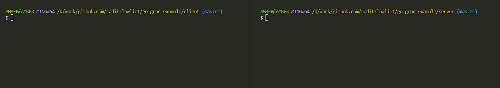

# go-grpc-example

this repository is example for article <https://medium.com/kanoteknologi/making-friend-communication-client-server-with-golang-and-grpc-ef05438c6f4>

## Version

Last update using

- go 1.23
- google.golang.org/grpc v1.67.1
- google.golang.org/protobuf v1.35.1

## Preview



## How to ...

- Regenerate protobuf, use this

```sh
protoc --go_out=. --go_opt=paths=source_relative \
    --go-grpc_out=. --go-grpc_opt=paths=source_relative \
    greeter/*.proto
```

- Run the server first

```sh
cd server
go run main.go
```

- Run the client try sending the greeter

```sh
cd client
go run main.go
```
